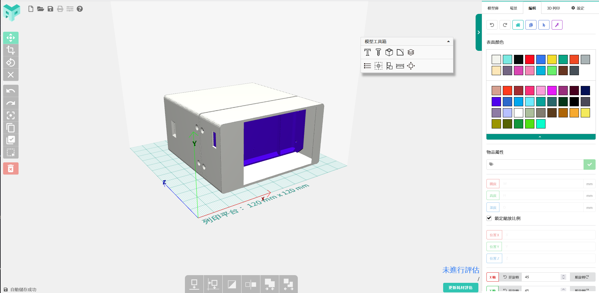

## Powerbank Case Design Files

### I only want to print the case

To 3D print the case, you only need the gcode file and a printer with bed size larger than 120 * 120mm. (Compatible with most Marlin firmware based 3D printer)

### I want to customize my case

There are two ways to edit the case to fit your needs. One is using Autodesk Inventor to edit the source files in .ipt formats. 

If you do not have a license to Autodesk Inventor, you can take a look at the "powerbank case.aprint.svg" file and import it to [aPrint Editor](https://aprint.io/editor/) which is a free cloud 3D modeling editor with advance features.

