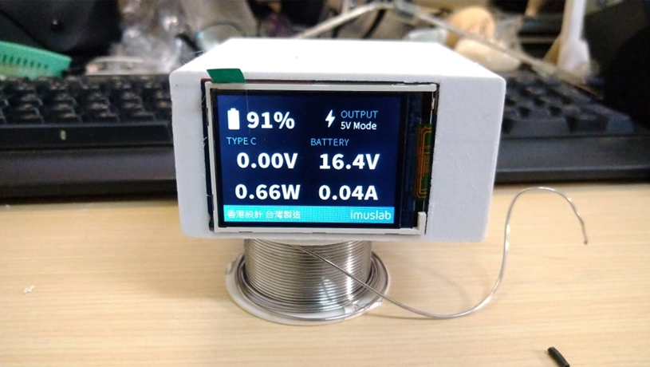
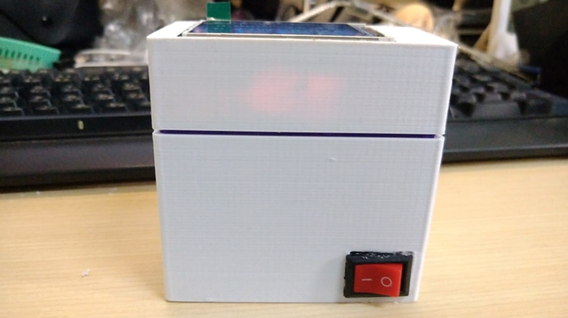

# DIY-60W-PD-Powerbank

A DIY 60W PD Power bank with real-time battery display for charging your laptop and smartphone

## Introduction

This is a type C only, 20V 3A (60W) supported power bank built by myself. The whole build process is about 2 months and it is a really handy little device to charge your laptop on the go. I designed this so that I don't need to always find a seat with socket nearby during lecture and it really helped me a lot during long and boring lectures :)

## Specification

- Panasonic 14.8V 3200mAh 4S 18650 battery pack
- PD3.0  5 / 9 / 15 / 20V output (Max 20V 3A, 60W)
- Real-time HMI display for battery information (Output power, voltage, battery voltage and drawing current)
  

## Building Instructions

This power bank contain 3 main parts. The power bank circuits (the battery, PD management board etc), the Arduino batinfo reader (Arduino, voltage dividers and current sensors) and the HMI display. The overall circuit diagram can be simplified as below.

All the parts then can be glued at the back of the HMI display as follows.

For more details on the build instructions, see the "Tutorial" folder.

For calibration process for the Arduino measurement sensors, see the Arduino Code folder's README file.

## Case

The case can be printed with a normal FDM printer. See "Case "folder for more information.

## Final Product

|  |  |
| ------------------------------------------------------------ | ------------------------------------------------------------ |
|  |  |
|  |  |

## License

 This work is licensed under a <a rel="license" href="http://creativecommons.org/licenses/by/4.0/">Creative Commons Attribution 4.0 International License</a>.

